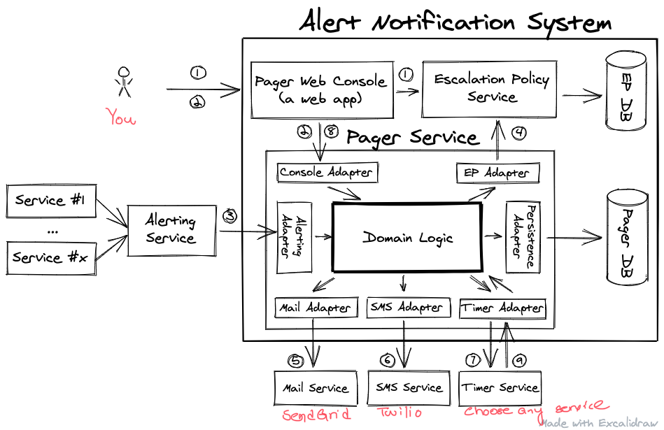

#  Technical Test - Alert Pager (Advanced - for System Architect, Senior Software Engineer and Tech Lead Roles)

The goal of this test is to evaluate:
- your modeling and testing skills of a small business case
- your ability to pair program with someone to add a new feature
- your ability to present your project to an audience

# Agenda

The following test has 3 parts:
1. at home, design and implement the domain logic of the pager service (~3h)
2. add a new feature during a pair programming session (1h)
3. present the result to two engineers (1h)

# Problem

For the sake of this exercise, let's imagine we want to implement an in-house alert notification system.

Here is the architecture of this system:



Through the web console, our engineer is able to read and edit the Escalation Policy:

(1). An Escalation Policy references a Monitored Service by its identifier. It contains an ordered list of levels. Each level contains a set of targets.

Each target can be of two types: email or SMS. Target contains the email address and SMS Target contains the Phone Number. This console also allows the engineer, when the incident is closed, to inform the Pager Service that the Monitored Service is now Healthy 

(2).The Monitored Service in case of dysfunction sends an Alert (composed of the Alert Message and the Identifier of the Service) to the Alerting Service (the alerts central place). Those alerts are forwarded to the Pager Service

(3). Then this service based on the Escalation Policy of the Monitored Service (available from the EP Service

(4)), sends the notifications to all the Targets of the first Policy Level, by mail

(5) or SMS (6). After that the service set an external timer for the Acknowledgement Timeout 

(7). A target must acknowledge the alert within 15-minutes 

(8). In case the Pager receives a Service Healthy event (2), the Monitored Service is flagged Healthy and no more notifications will be sent until the next Alert. In case of Acknowledgement Timeout 

(9) with no prior Alert Acknowledgement (8) or Healthy event (2), the Pager Service escalates to the next Policy Level to notify the targets of the second level and set the timer. And so on...

## Use Case Scenarios

Here is the list of Use Case Scenarios that specify what the Pager Service needs to accomplish:

```
Given a Monitored Service in a Healthy State,
when the Pager receives an Alert related to this Monitored Service,
then the Monitored Service becomes Unhealthy,
the Pager notifies all targets of the first level of the escalation policy,
and sets a 15-minutes acknowledgement delay
```

```
Given a Monitored Service in an Unhealthy State,
the corresponding Alert is not Acknowledged
and the last level has not been notified,
when the Pager receives the Acknowledgement Timeout,
then the Pager notifies all targets of the next level of the escalation policy
and sets a 15-minutes acknowledgement delay.
```

```
Given a Monitored Service in an Unhealthy State
when the Pager receives the Acknowledgement
and later receives the Acknowledgement Timeout,
then the Pager doesn't notify any Target
and doesn't set an acknowledgement delay.
```

```
Given a Monitored Service in an Unhealthy State,
when the Pager receives an Alert related to this Monitored Service,
then the Pager doesn’t notify any Target
and doesn’t set an acknowledgement delay
```

```
Given a Monitored Service in an Unhealthy State,
when the Pager receives a Healthy event related to this Monitored Service
and later receives the Acknowledgement Timeout,
then the Monitored Service becomes Healthy,
the Pager doesn’t notify any Target
and doesn’t set an acknowledgement delay
```

**Please note** that many concurrency issues can happen in this system. For example, is the Pager Service allowed to send 2 notifications to the same target when 2 alerts (same or different one) are received at the same time ? Theis answer to this question is a product decision. For the sake of this exercise, let’s say the answer is “no” (only 1 notification is sent). So take care of this during your design phase. Even if database persistence is not part of the exercise, tell us in your README file what guarantees you expect from the database.

# 1. Homework (3 hours)

Implement a model and unit tests for the domain logic of the Pager Service with the programming language and paradigm you prefer. For that, you need also to define interfaces between the adapters & the domain logic. But you must **not** implement any adapters. This is just about pure domain modeling. Keep things simple and straightforward.

:warning: Do not fork this repository and do not submit any Pull Requests :warning:

When you're done, please create your public repository on GitHub and communicate the URL to the Talent Acquisition Specialist.

Make sure that you put the instructions in your README file on how to run unit tests so that we can easily see the result.


# 2. Presentation and collective review (1 hour)

During this session, you have the opportunity to present **in english** your project to two engineers. You could consider that those engineers are familiar with the problem but not with your solution. Present the model and your test strategy.

Be sure to have a working environment before this session.


Engineers will ask you some questions.

For example:
- What could be the AWS infrastructure of this Alerting Notification System ?
- Explains how you manage the Consistency Issue (2 alerts received at the same time) ?

# Questions

__Feel free to apply! Drop us a line with your Linkedin/Github/Twitter/AnySocialProfileWhereYouAreActive at hr@turingtechnologies.org__

Thanks!
